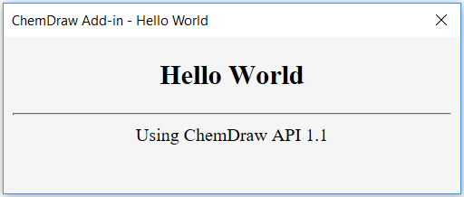
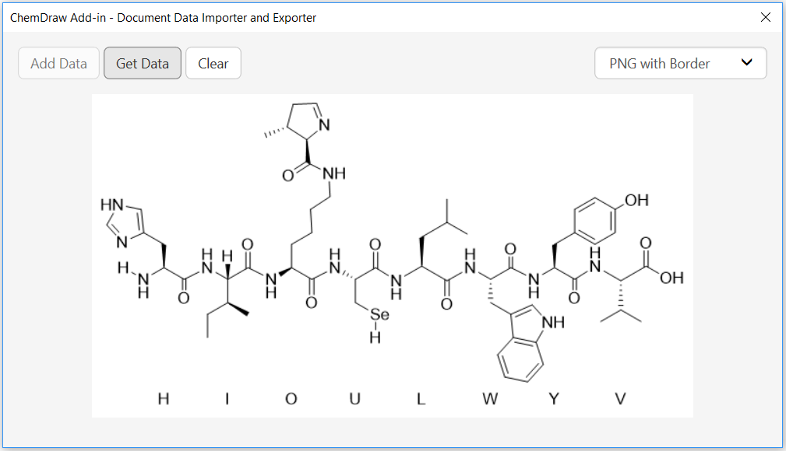
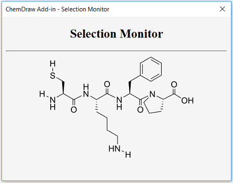

# ChemDraw Web Source Add-in Examples

Welcome to the ChemDraw web source add-in examples! This directory contains examples that can be used for learning ChemDraw add-in API and testing ChemDraw add-ins that are loaded from web sources.

## How to Use?

Launch ChemDraw Office, and go to **Add-ins > Add-in Manager... > Add > Add from URL...**, and enter a URL that directs to an add-in manifest listed in [manifest examples](https://github.com/zhanglin-wu/ChemDraw-WebSourceAddins/tree/master/Manifests).

## [Manifest Examples](https://github.com/zhanglin-wu/ChemDraw-WebSourceAddins/tree/master/Manifests)

### Valid Add-ins
1. A manifest containing all valid add-ins
    - `https://raw.githubusercontent.com/zhanglin-wu/ChemDraw-WebSourceAddins/master/Manifests/all-valid-addins-manifest.json`

### Error Cases

1. A manifest that is an empty string (i.e. empty file)
    - `https://raw.githubusercontent.com/zhanglin-wu/ChemDraw-WebSourceAddins/master/Manifests/empty-file-manifest.json`
2. A manifest that is an empty JSON object
    - `https://raw.githubusercontent.com/zhanglin-wu/ChemDraw-WebSourceAddins/master/Manifests/empty-json-object-manifest.json`
3. A manifest that is invalid JSON format data
    - `https://raw.githubusercontent.com/zhanglin-wu/ChemDraw-WebSourceAddins/master/Manifests/invalid-json-format-manifest.json`
4. A manifest containing a source name that is an empty string
    - `https://raw.githubusercontent.com/zhanglin-wu/ChemDraw-WebSourceAddins/master/Manifests/empty-source-name-manifest.json`
5. A manifest containing an empty list of add-ins
    - `https://raw.githubusercontent.com/zhanglin-wu/ChemDraw-WebSourceAddins/master/Manifests/empty-addin-list-manifest.json`
6. A manifest containing no "soureName" field
    - `https://raw.githubusercontent.com/zhanglin-wu/ChemDraw-WebSourceAddins/master/Manifests/no-source-name-field-manifest.json`
7. A manifest containing no "addins" field
    - `https://raw.githubusercontent.com/zhanglin-wu/ChemDraw-WebSourceAddins/master/Manifests/no-addins-field-manifest.json`
8. A manifest containing duplicate add-ins (i.e. they have duplicate names and duplicate metadata URLs)
    - `https://raw.githubusercontent.com/zhanglin-wu/ChemDraw-WebSourceAddins/master/Manifests/duplicate-addins-manifest.json`
9. A manifest containing different add-ins with duplicate names
    - `https://raw.githubusercontent.com/zhanglin-wu/ChemDraw-WebSourceAddins/master/Manifests/duplicate-names-manifest.json`
10. A manifest containing add-ins with duplicate metadata URLs
    - `https://raw.githubusercontent.com/zhanglin-wu/ChemDraw-WebSourceAddins/master/Manifests/duplicate-metadata-urls-manifest.json`
11. A manifest containing an add-in with a name that is duplicate with an existing add-in name
    - `https://raw.githubusercontent.com/zhanglin-wu/ChemDraw-WebSourceAddins/master/Manifests/addin-name-duplicate-with-existing-addin-manifest.json`
12. A manifest containing add-ins with duplicate menu-item texts
    - Test Case 1. In the same manifest, two different add-ins use duplicate menu-item texts
        - `https://raw.githubusercontent.com/zhanglin-wu/ChemDraw-WebSourceAddins/master/Manifests/duplicate-menu-items-manifest.json`

    - Test Case 2. In two manifests, an add-in from the first manifest and another add-in from the second manifest use duplicate menu-item texts, we can test them by installing the first manifest and then the second manifest
        - First Manifest: `https://raw.githubusercontent.com/zhanglin-wu/ChemDraw-WebSourceAddins/master/Manifests/duplicate-menu-items-manifest1.json`
        - Second Manifest: `https://raw.githubusercontent.com/zhanglin-wu/ChemDraw-WebSourceAddins/master/Manifests/duplicate-menu-items-manifest2.json`
13. A manifest containing different add-ins with names diff only by case-sensitive string comparison
    - `https://raw.githubusercontent.com/zhanglin-wu/ChemDraw-WebSourceAddins/master/Manifests/case-sensitive-names-manifest.json`
14. A manifest containing duplicate add-ins with an installed manifest, i.e. these two manifests contain duplicate add-ins, we can test them by installing the first manifest and then the second manifest
    - First Manifest: `https://raw.githubusercontent.com/zhanglin-wu/ChemDraw-WebSourceAddins/master/Manifests/duplicate-addins-manifest1.json`
    - Second Manifest: `https://raw.githubusercontent.com/zhanglin-wu/ChemDraw-WebSourceAddins/master/Manifests/duplicate-addins-manifest2.json`
15. Manifests containing add-ins with invalid fields in the add-in metadata
    - The add-in name is an empty string
        - `https://raw.githubusercontent.com/zhanglin-wu/ChemDraw-WebSourceAddins/master/Manifests/empty-addin-name-manifest.json` 
    - The menu-item text of the add-in is an empty string
        - `https://raw.githubusercontent.com/zhanglin-wu/ChemDraw-WebSourceAddins/master/Manifests/empty-addin-menu-item-manifest.json`
    - The add-in launch URL of the add-in is an empty string
        - `https://raw.githubusercontent.com/zhanglin-wu/ChemDraw-WebSourceAddins/master/Manifests/empty-addin-launch-url-manifest.json`
    - The required minimum API version of the add-in is not satisfied
        - `https://raw.githubusercontent.com/zhanglin-wu/ChemDraw-WebSourceAddins/master/Manifests/addin-required-minimum-API-version-unsatisfied-manifest.json`

## [Add-in Examples](https://github.com/zhanglin-wu/ChemDraw-WebSourceAddins/tree/master/Add-ins)

### [Hello World](https://zhanglin-wu.github.io/ChemDraw-WebSourceAddins/Add-ins/Hello%20World/main.html)

A simple ChemDraw add-in that shows the version of the ChemDraw add-in API.

### [Document Data Importer and Exporter](https://zhanglin-wu.github.io/ChemDraw-WebSourceAddins/Add-ins/Document%20Data%20Importer%20and%20Exporter/main.html)

A ChemDraw add-in that uses ChemDraw add-in API to add and get data in the active document. The supported data formats are CDXML, CDX encoded as [Base64](https://en.wikipedia.org/wiki/Base64), [SMILES](http://www.daylight.com/dayhtml/doc/theory/theory.smiles.html), [InChI](https://iupac.org/who-we-are/divisions/division-details/inchi/), [InChIKey](https://iupac.org/who-we-are/divisions/division-details/inchi/), [MolV2000](http://accelrys.com/products/collaborative-science/biovia-draw/ctfile-no-fee.html), [MolV3000](http://accelrys.com/products/collaborative-science/biovia-draw/ctfile-no-fee.html), [RXNV2000](http://accelrys.com/products/collaborative-science/biovia-draw/ctfile-no-fee.html), [RXNV3000](http://accelrys.com/products/collaborative-science/biovia-draw/ctfile-no-fee.html), and PNG encoded as [Base64](https://en.wikipedia.org/wiki/Base64).

### [Selection Monitor](https://zhanglin-wu.github.io/ChemDraw-WebSourceAddins/Add-ins/Selection%20Monitor/main.html)

A ChemDraw add-in that uses the selection API to get the preview image of the selected structures in the active document.

